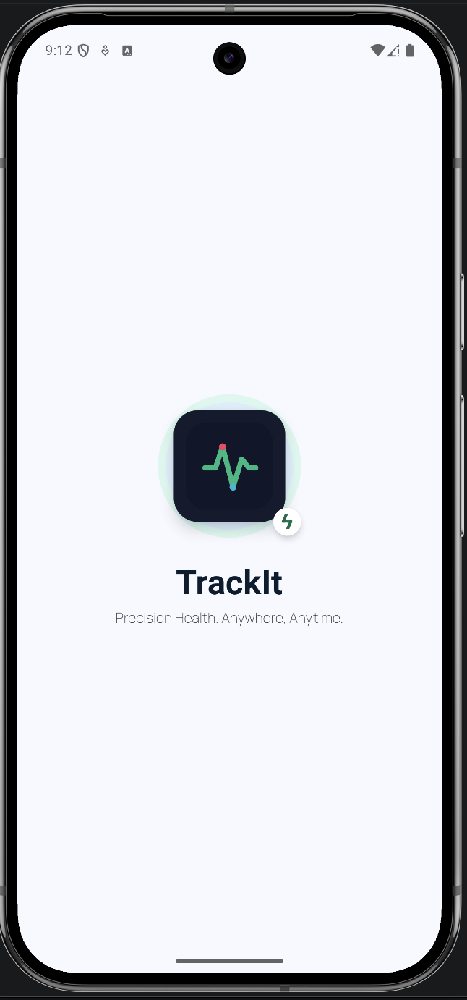
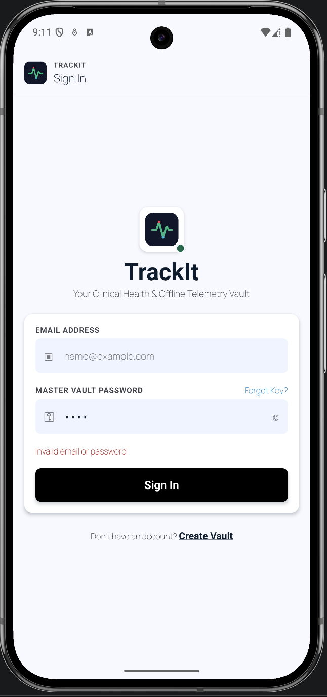
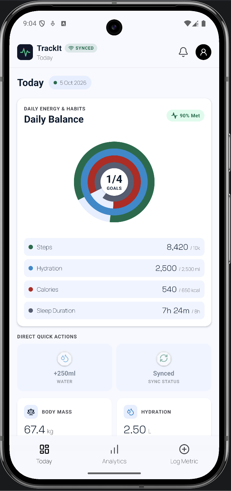
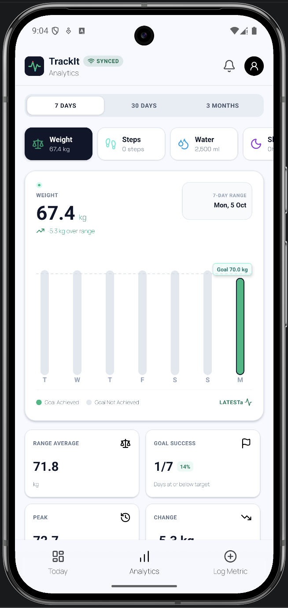
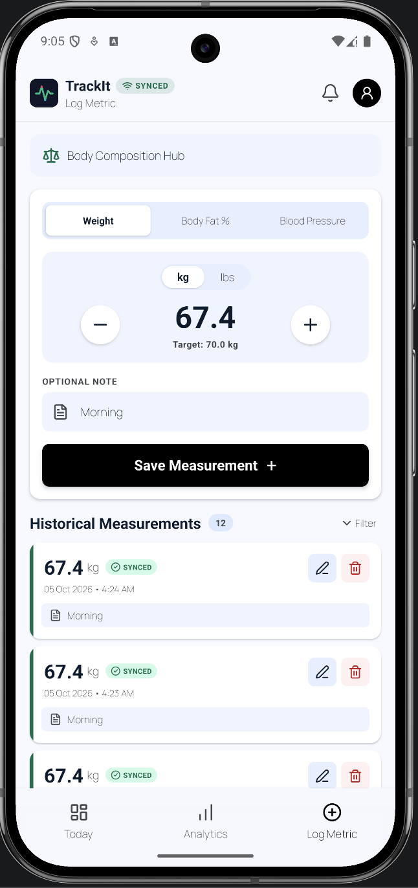
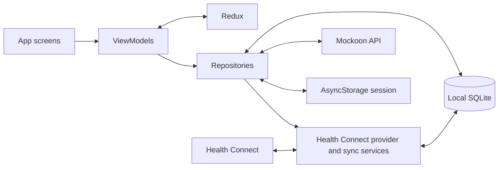

# TrackIt Health Tracker

TrackIt is a React Native health tracker with Android Health Connect integration for importing steps, sleep, and active calories, and writing weight and hydration data. It uses a local SQLite database as the durable source for health data, Redux Toolkit for active application state, and an HTTP API for login, initial data loading, and synchronization.

<!--  -->

<p>
  
  
  
  
  
</p>

## Features

- Today dashboard for daily goals, water, sleep, weight, and other metrics.
- Analytics charts for weight, steps, water, sleep, and calories.
- Android Health Connect integration to import steps, sleep, and active calories, and write back weight and hydration records.
- Add, edit, and delete weight measurements, with pending/synced status.
- Per-user SQLite persistence and an offline outbox for weight and water changes.
- Manual Sync Now, optional per-user Auto sync while the app is active, and retries for transient HTTP failures.
- Version-based sync conflict detection with user choices to keep the local value or use the server value.
- Session restoration and per-user local health data.

## Requirements

- Node.js `>=22.11.0` and npm.
- React Native `0.87.1`.
- Android Studio, Android SDK, and an Android emulator or device.
- [Mockoon Desktop](https://mockoon.com/) to run the standalone mock API on port `3000`. Mockoon is not bundled with this repository.

## Setup

1. Install JavaScript dependencies from the project root:

   ```sh
   npm install
   ```

2. Start Mockoon Desktop, select or create an environment, and configure it to listen on port `3000`. Add these routes to the Mockoon environment:

   | Method | Path | Request |
   | --- | --- | --- |
   | `POST` | `/login` | `{ "email": "...", "password": "..." }` |
   | `GET` | `/fetchAllData` | Requires `x-user-id` header |
   | `POST` | `/syncLocalToServer` | Requires `x-user-id` header and the health payload as JSON |

   `/login` should return an `AuthUser` (`id`, `displayName`, `email`, `accessToken`) on success. The app displays the API's `error` field for failed login responses.

   **Android emulator networking:** the app uses `http://10.0.2.2:3000` to reach the development computer. On other platforms the configured host is `localhost`. A physical Android device needs a host address reachable on the same network.

   I have attached the mockoon config file under mockoon/config.json.
   Copy the content then open mockoon app -> new local environment from clipboard. It will auto create an environemnt with all the required apis even with the responses. After that just click on the play green button to start the mockoon server.

3. Start Metro in one terminal:

   ```sh
   npm start
   ```

4. Build and launch Android from another terminal:

   ```sh
   npm run android
   ```

   To build without launching the app:

   ```sh
   cd android
   ./gradlew assembleDebug
   ```

## Architecture

TrackIt uses **MVVM with clear separation of concerns**:

- **Views** render screens and forward user actions.
- **ViewModels** coordinate feature behavior and expose display-ready state.
- **Models** define the health data and authentication contracts.
- **Data/Repositories** isolate the API, SQLite, session storage, and Health Connect access.

Redux holds active application state; SQLite is the durable local health data source. The Health Connect provider imports device metrics into SQLite and writes app-managed weight and hydration changes back to Health Connect.



### State Management

- Redux Toolkit stores authentication/session state and the active user's `today`, `analytics`, `logMetric`, and pending sync count.
- ViewModels coordinate user actions, repository calls, and presentation ready values.
- Views render ViewModel/Redux state and pass user actions back to the ViewModels.

### Local Persistence

SQLite stores health data scoped by `user_id`. The main tables are:

- `local_users`: local account identity.
- `metric_goals`: Today and Analytics goals.
- `metric_records`: Today values, Analytics points, and measurements, including sync/deletion status.
- `analytics_metrics` and `analytics_ranges`: Analytics labels, current values, range boundaries, and bucket metadata.
- `user_health_settings` and `health_data_options`: Today settings, Analytics defaults, Log Metric draft, and option lists.
- `sync_outbox`: queued upsert/delete operations.


## Health and Device Integration

TrackIt integrates with **Android Health Connect** through `react-native-health-connect`. This integration is Android-only; Apple HealthKit is not implemented.

- **Reads:** daily steps, active calories, and sleep sessions. Sleep sessions are grouped by wake date, duplicate sessions are de-duplicated, and available stage durations (deep, REM, light, and awake) are summarized.
- **Writes:** logged weight measurements and daily water totals are written to Health Connect when the corresponding write permission is granted.
- **Permissions:** access is requested for steps, sleep, and active calories (read), weight and hydration (write), and historical health data (read). Users can grant only some permissions; the app reports partial access and imports the metrics it can read.
- **Import window:** with historical-data access, the initial backfill covers up to 90 days; without it, up to 30 days. Later refreshes cover the most recent 7 days. Imports are stored per user in SQLite and refresh when the main tabs load and when the app returns to the foreground.
- **Display:** imported steps, sleep, and calories populate Today and Analytics. Sleep is stored in minutes and shown in hours in Analytics. Weight and water continue to use the app's local/server data and are not replaced by device imports.
- **Write-back queue:** weight and water writes are queued locally and retried on later flushes after failures. The same client record ID is reused for a queued operation to reduce duplicate writes.

Health Connect must be available and the requested permissions must be granted for device data to appear. Device health integration is not an OS-managed background task; refreshes are initiated while the app is active.

## Offline and Synchronization

- On first health data load for a user with no local SQLite data, the app calls `GET /fetchAllData` with that user's `x-user-id`, normalizes the response, and persists it.
- For a user with local data, reads come from SQLite. This avoids replacing offline edits with a fresh server snapshot on every launch.
- Weight and water changes are committed to SQLite and queued in `sync_outbox` before Redux is updated. Health Connect write-backs for weight and water use a separate persistent queue and can be flushed again after a failure.
- Sync Now and Auto-sync use the same per-user sync service. Auto-sync is an optional per-user setting stored in AsyncStorage; it runs while the app is active, connected, and has pending changes. Server changes are also pulled when the app becomes active.
- Uploads send the SQLite-backed health payload and per-record changes to `POST /syncLocalToServer` with the user's `x-user-id`. The outbox snapshot is acknowledged only after a successful response; newer edits made during an upload remain queued.
- The app pulls incremental server updates from `GET /fetchChanges`, using a saved per-user cursor. A failed pull is best effort and does not discard an upload that already succeeded.
- Transient network failures, timeouts, and selected HTTP statuses (`408`, `425`, `429`, and `5xx`) are retried up to two times with exponential backoff and jitter. Other client errors are not retried.
- Offline changes remain on-device and queued until a later successful sync. Initial data loading for a new local user requires the server to be reachable.

## Conflict Resolution

SQLite is the durable source of truth for local health data. Each queued weight or water change includes the server version it was based on. During sync, per-record server results are used to acknowledge accepted changes, keep rejected or unanswered changes queued, and store conflicts that include both the local edit and the server state.

Pulled server changes are applied when there is no pending local edit. If a local edit is pending and its version differs from the server version, the app preserves both versions as an open conflict instead of silently overwriting the local edit. Repeated server changes update the server side of an existing conflict.

Users can resolve an open conflict by choosing **Keep mine** or **Use server**. Keeping the local value re-queues it against the latest server version; choosing the server value applies that state locally. Failed sync requests leave queued changes available for a later retry. Conflict resolution is implemented for weight and water records.

## Key Technical Decisions

- Requirements were brainstormed and the main product priorities were first captured on paper.
- The initial UI direction was created with Google Stitch's AI designer. Connecting <strong><u>Stitch MCP to VS Code</u></strong> Copilot was considered as part of the design workflow.

   Design: [Created App Design](https://stitch.withgoogle.com/projects/9808366889060079459)
- A skeleton data-source structure was created before feature data was integrated, keeping UI, ViewModel, model, and repository responsibilities separate.
- Redux Toolkit was selected for active session state; SQLite was added for per-user durable/offline health data.
- Android Health Connect was selected as the device health data source for importing steps, sleep, and active calories, with write-back support for weight and hydration. The integration is Android-only; HealthKit support is outside the current platform scope.

## Testing and Quality Checks

The Jest suite currently includes focused tests for:

- `__tests__/App.test.tsx`: basic app rendering.
- `__tests__/authRepository.test.ts`: successful login and server-provided invalid-credentials errors.
- `__tests__/deviceMetricsOverlay.test.ts`: device metrics replacing the supported Today and Analytics values, including ranges and placeholders.
- `__tests__/healthSyncService.test.ts`: failed uploads retaining queued changes, acknowledgement of uploaded changes, and recording conflicts.
- `__tests__/httpRetry.test.ts`: retrying transient failures, skipping client errors, and stopping after the retry limit.
- `__tests__/sleepNormalizer.test.ts`: sleep wake-date assignment, stage summaries, duplicate sessions, and sessions without stages.
- `__tests__/syncConflicts.test.ts`: per-record sync result partitioning and decisions for applying, ignoring, or conflicting server changes.

Run the complete suite from the project root:

```sh
npm test -- --runInBand
```

Run the TypeScript and lint checks from the project root:

```sh
npx tsc --noEmit
npm run lint
```

The current tests focus on selected logic and mocked sync behavior. They do not exercise Health Connect on a device, SQLite persistence and migrations, or the full conflict-resolution flow against a backend.

## Performance Considerations

- SQLite queries are supported by indexes on user/metric/date and outbox ordering. Related local edits, device imports, and conflict updates are grouped in transactions.
- Health Connect imports are limited to a 90-day initial backfill (30 days without history permission) and then a 7-day rolling refresh. Imported rows are written in 30-day chunks; sleep-session reads use paginated requests.
- Per-user sync and device refresh work is coalesced while an operation is already in flight. Health data is hydrated into Redux for the active session, so tab changes can reuse loaded state without repeating database or API reads.
- Analytics currently builds bounded 7-, 30-, and 90-day device metric ranges. Large measurement histories and the full-payload sync request can still grow with user data; loading chart ranges and syncing only changed records are future optimization opportunities.

## Known Limitations

- First login/data initialization requires network access. Explicit logout clears the session, so signing in again also requires network access; that user's local SQLite data is retained.

- Auto-sync does not run as an OS background task after the app is terminated.

## What you would improve with more time
- Update only the required changed value for sync operation.

## Thoughts

Performance:
Keep all raw health records in SQLite, but don’t load years of records into JavaScript or Redux just to draw a chart. Load only a summary for the selected metric and date range. WHere all possible use Pagination if possible if the data length is more.

Architectural Decisions:
Redux Toolkit: Health and session state is shared across Today, Analytics, and Log Metric. Redux keeps that state and its updates in one predictable place, without passing it through every screen. SQLite still stores health data permanently; Redux holds the current app state.

React Navigation: The app needs both a sign in flow and easy switching between its main tabs. React Navigation provides stack and tab navigators that fit that structure and are commonly used in React Native apps.

SQLite: Health records need to persist on the device and remain available offline. SQLite stores them in structured, peruser tables. it’s a better fit for that than keeping the full dataset in Redux or AsyncStorage.

Charting Library: Gifted Charts, It provides ready made React Native charts that can be styled for Analytics, saving the work of building chart rendering from scratch.

Separation of concerns: We are using MVVM. MVVM separates the screen from the logic behind it. The View displays the screen, the ViewModel handles user actions and prepares the data, and the Model and repositories define and load or save that data.

#### Implementation Summary and Design Decisions:

What you implemented : 
* Created a complete UI design with <strong><u>Google Stitch &amp; MCP</u></strong>.
* Mocked API using Mockoon stand alone tool.
* Created a Today screen showing health metrics such as steps, water, sleep, and weight, along with daily goals and progress.
* Created an Analytics screen with charts for health metrics over different time periods.
* Added a Log Metric screen where users can add, update, and delete weight measurements.
* Added login and load the user’s health data from the API.
* Saved health data on the device, so users can view and update it offline.
* Added manual sync and optional auto-sync to send local changes to the server when online.
* Integrated Android Health Connect to import steps, sleep, and active calories, and write logged weight and hydration data back when permissions are granted.

What you partially implemented : 
* Editing of only weight & water metrics. Remaining metrics can be promoted for editing.

What you designed but did not implement: 
* Better error views,
* Filters for history,
* light & dark mode switching

What you would implement next:
* Manage large data set(pagination where all is possible)
* Manage app life cycle

Any assumptions you made:
* Initial setup needs a network connection for first time login. A new user’s health data must be fetched before local use can begin.

Any trade-offs you made:
* Full-payload sync simplifies the API contract but sends unchanged sections along with locally changed values
* Sync does not run as an OS background task after the app is terminated.
