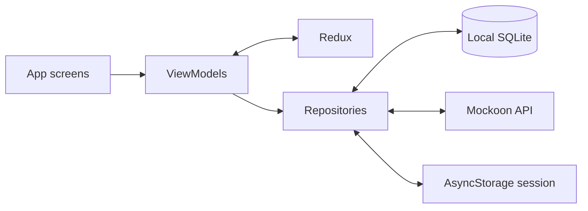

# TrackIt Health Tracker

TrackIt is a React Native health tracker. It uses a local SQLite database as the durable source for health data, Redux Toolkit for active application state, and an HTTP API for login, initial data loading, and synchronization.

## Features

- Today dashboard for daily goals, water, sleep, weight, and other metrics.
- Analytics charts for weight, steps, water, sleep, and calories.
- Weight measurement logging with pending/synced status.
- Per-user SQLite persistence and an offline outbox.
- Manual Sync Now and an optional per-user Auto-sync setting.
- Session restoration.

## Requirements

- Node.js `>=22.11.0` and npm.
- React Native `0.87.1`.
- Android Studio, Android SDK, and an Android emulator or device.
- [Mockoon Desktop](https://mockoon.com/) to run the standalone mock API on port `3000`. Mockoon is not bundled with this repository.

## Setup

1. Install JavaScript dependencies from the project root:

   ```sh
   npm install
   ```

2. Start Mockoon Desktop, select or create an environment, and configure it to listen on port `3000`. Add these routes to the Mockoon environment:

   | Method | Path | Request |
   | --- | --- | --- |
   | `POST` | `/login` | `{ "email": "...", "password": "..." }` |
   | `GET` | `/fetchAllData` | Requires `x-user-id` header |
   | `POST` | `/syncLocalToServer` | Requires `x-user-id` header and the health payload as JSON |

   `/login` should return an `AuthUser` (`id`, `displayName`, `email`, `accessToken`) on success. The app displays the API's `error` field for failed login responses.

   **Android emulator networking:** the app uses `http://10.0.2.2:3000` to reach the development computer. On other platforms the configured host is `localhost`. A physical Android device needs a host address reachable on the same network.

   I have attached the mockoon config file under mockoon/config.json.
   Copy the content then open mockoon app -> new local environment from clipboard. It will auto create an environemnt with all the required apis even with the responses. After that just click on the play green button to start the mockoon server.

3. Start Metro in one terminal:

   ```sh
   npm start
   ```

4. Build and launch Android from another terminal:

   ```sh
   npm run android
   ```

   To build without launching the app:

   ```sh
   cd android
   ./gradlew assembleDebug
   ```

## Architecture

TrackIt uses **MVVM with clear separation of concerns**:

- **Views** render screens and forward user actions.
- **ViewModels** coordinate feature behavior and expose display-ready state.
- **Models** define the health-data and authentication contracts.
- **Data/Repositories** isolate Mockoon API, SQLite, and session-storage access.

Redux holds active session state; SQLite is the durable local health-data source.



### State Management

- Redux Toolkit stores authentication/session state and the active user's `today`, `analytics`, `logMetric`, and pending-sync count.
- ViewModels coordinate user actions, repository calls, and presentation-ready values.
- Views render ViewModel/Redux state and pass user actions back to the ViewModels.

### Local Persistence

SQLite stores health data scoped by `user_id`. The main tables are:

- `local_users`: local account identity.
- `metric_goals`: Today and Analytics goals.
- `metric_records`: Today values, Analytics points, and measurements, including sync/deletion status.
- `analytics_metrics` and `analytics_ranges`: Analytics labels, current values, range boundaries, and bucket metadata.
- `user_health_settings` and `health_data_options`: Today settings, Analytics defaults, Log Metric draft, and option lists.
- `sync_outbox`: queued upsert/delete operations.


## Health and Device Integration

**Not implemented.** The app does not currently read from Apple HealthKit, Android Health Connect, wearable sensors, or device health APIs. Health data currently comes from the backend response and local user edits.

## Offline and Synchronization

- On first health-data load for a user with no local SQLite data, the app calls `GET /fetchAllData` with that user's `x-user-id`, normalizes the response, and persists it.
- For a user with local data, reads come from SQLite. This avoids replacing offline edits with a fresh server snapshot on every launch.
- Water and weight changes are persisted locally and queued in `sync_outbox` before Redux is updated.
- Sync Now and Auto-sync use the same service. Auto-sync is an optional per-user setting stored in AsyncStorage and runs while the app is active, online, and has pending changes.
- Sync sends the SQLite-backed health payload to `POST /syncLocalToServer` with `x-user-id`.
- The outbox is acknowledged only after a successful HTTP response. Changes made during an in-flight upload remain queued if they were not part of that upload's outbox snapshot.
- Offline changes remain on-device and queued until a later successful sync.

## Conflict Resolution

SQLite is the source of truth for local health data. Sync uploads the local payload when changes are pending and keeps those changes queued if the request fails.

## Key Technical Decisions

- Requirements were brainstormed and the main product priorities were first captured on paper.
- The initial UI direction was created with Google Stitch's AI designer. Connecting Stitch MCP to VS Code Copilot was considered as part of the design workflow.

    For design : `https://stitch.withgoogle.com/projects/9808366889060079459`
- A skeleton data-source structure was created before feature data was integrated, keeping UI, ViewModel, model, and repository responsibilities separate.
- Redux Toolkit was selected for active session state; SQLite was added for per-user durable/offline health data.

## Testing and Quality Checks

Focused tests currently cover:

- `__tests__/authRepository.test.ts`: successful login request/response and server-provided invalid-credentials error.
- `__tests__/healthSyncService.test.ts`: failed sync leaves queued changes untouched; successful sync acknowledges only the submitted operations.

Run an individual test file from the project root:

```sh
npm test -- --runInBand __tests__/authRepository.test.ts
npm test -- --runInBand __tests__/healthSyncService.test.ts
```

Run static checks:

```sh
npx tsc --noEmit
npm run lint
```

## Performance Considerations

- Add SQLite indexes and group related writes in transactions.
- Health data is hydrated into Redux for the active session, so switching tabs uses in-memory state rather than repeating API or database loads.

## Trade-offs

- Full-payload sync simplifies the API contract but sends unchanged sections along with locally changed values.
- Auto-sync is simple to operate while the app is open, but does not run as an OS background task after the app is terminated.

## Known Limitations

- First login/data initialization requires network access. Explicit logout clears the session, so signing in again also requires network access; that user's local SQLite data is retained.
- Add Health Connect/HealthKit integration, OS-managed background sync, focused database migration tests, and targeted Analytics/per-write performance improvements.
- Auto-sync is simple to operate while the app is open, but does not run as an OS background task after the app is terminated.

## What you would improve with more time
- Handle scenarios of same user logs in different device and updates the data.
- Update only the required changed value for sync operation.
- Look into manage years of data to show over UI.

## Thoughts
Suggestion to conflict resolution: Keep conflicted operations queued and let the app apply a clear policy: keep the server value, keep the local value, or let the user decide. Don’t resolve health-data conflicts just by comparing timestamps.

For maintaining idempotency: Create the ID once when you queue a change, save it in SQLite, and reuse that saved ID every time you retry. Never generate a new ID for a retry.

Performance:
Keep all raw health records in SQLite, but don’t load years of records into JavaScript or Redux just to draw a chart. Load only a summary for the selected metric and date range. WHere all possible use Pagination if possible if the data length is more.

    Handling error scenarios:
    Initial loading: Today, Analytics, and Log Metric show a spinner until their health data is available. Health data is loaded from SQLite; if that user has no local data yet, the app fetches it from the API and saves it locally.

    API failure: If initial health-data loading fails, the error is shown instead of the screen content. Login failures also show an error. 

    Failed synchronization: The app shows an alert and keeps queued changes on the device for a later retry. Offline sync attempts also show an alert.

Architectural Decisions:
Redux Toolkit: Health and session state is shared across Today, Analytics, and Log Metric. Redux keeps that state and its updates in one predictable place, without passing it through every screen. SQLite still stores health data permanently; Redux holds the current app state.

React Navigation: The app needs both a sign in flow and easy switching between its main tabs. React Navigation provides stack and tab navigators that fit that structure and are commonly used in React Native apps.

SQLite: Health records need to persist on the device and remain available offline. SQLite stores them in structured, peruser tables. it’s a better fit for that than keeping the full dataset in Redux or AsyncStorage.

Charting Library: Gifted Charts, It provides ready made React Native charts that can be styled for Analytics, saving the work of building chart rendering from scratch.

Separation of concerns: We are using MVVM. MVVM separates the screen from the logic behind it. The View displays the screen, the ViewModel handles user actions and prepares the data, and the Model and repositories define and load or save that data.

#### Implementation Summary and Design Decisions:

What you implemented : 
* Created a complete UI design with google stitch & MCP.
* Mocked API using Mockoon stand alone tool.
* Created a Today screen showing health metrics such as steps, water, sleep, and weight, along with daily goals and progress.
* Created an Analytics screen with charts for health metrics over different time periods.
* Added a Log Metric screen where users can add, update, and delete weight measurements.
* Added login and load the user’s health data from the API.
* Saved health data on the device, so users can view and update it offline.
* Added manual sync and optional auto-sync to send local changes to the server when online.

What you partially implemented : 
* Updation and syncing of only weight & water metrics. Remaining metrics are pending.

What you designed but did not implement: 
* Better error views,
* Filters for history,
* light & dark mode switching

What you would implement next:
* Allowing edit option for all the metrics,
* Multi user concurrent usage(same time different devices) conflict resolution,
* Manage large data set(pagination where all is possible)
* Manage app life cycle
* Integrate health fitness data from external data provider. 
* Api retry logic

Any assumptions you made:
* Initial setup needs a network connection. A new user’s health data must be fetched before local use can begin.

Any trade-offs you made:
* Full-payload sync simplifies the API contract but sends unchanged sections along with locally changed values
* Auto-sync is simple to operate while the app is open, but does not run as an OS background task after the app is terminated.